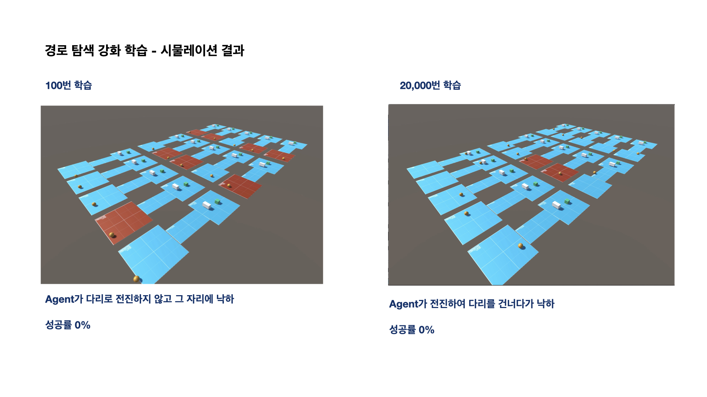

# ML-Agents

---
## 시물레이션 동영상

### 100번 학습

https://user-images.githubusercontent.com/32379049/130354458-72e53223-3949-4117-8964-0b5ef39e4be4.mp4

### 20,000번 학습

https://user-images.githubusercontent.com/32379049/130354462-2f566ac1-51a6-41cb-aebf-4a40fa742e96.mp4

### 80,000번 학습

https://user-images.githubusercontent.com/32379049/130354463-a1ad4fdd-04a6-48a7-a1e7-efe74d35cc6c.mp4

### 300,000번 학습

https://user-images.githubusercontent.com/32379049/130354594-05f736b4-9928-495e-b2b3-30aa28b86b40.mov
### 자동주차 학습 결과

https://user-images.githubusercontent.com/32379049/130354510-3cc4a4e8-d6d5-4afb-961a-0ec80c3bf01b.mov

